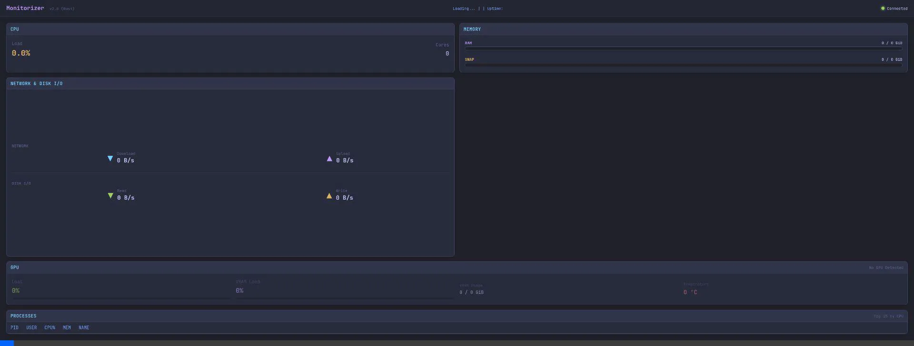

# 🚀 Monitorizer (Rust Edition)

A high-performance, real-time system monitor inspired by **BTOP**, rebuilt for the web using **Rust** and **Tailwind CSS**.



## 🌟 Overview

**Monitorizer** is a terminal-aesthetic web application built with **Rust** to ensure **maximum efficiency and minimal resource footprint**. Designed to be lightweight, it provides real-time system insights without compromising your computer's performance.

### Why use Monitorizer?
*   **Built for Efficiency**: Leverages the memory safety and speed of Rust to achieve peak performance, ensuring the monitoring tool itself doesn't steal valuable cycles from your heavy workloads (like training models or gaming).
*   **AI Training Monitoring**: Keep an eye on your GPU VRAM and Power consumption while training models from your living room or kitchen using your smartphone.
*   **Dual Screen for Tablet**: Turn your tablet into a dedicated system monitoring screen without plugging in extra monitors to your GPU.
*   **Mobile-Ready**: Fully responsive design with collapsible panels designed for small screens.
*   **Ultra-Low Latency**: Uses non-blocking asynchronous I/O (Axum + Tokio) and Server-Sent Events (SSE) to deliver near-instant updates.

## ✨ Key Features

*   **Multi-Vendor GPU Support**: Dynamic detection for **NVIDIA** (via NVML), **AMD**, and **Intel** (via sysfs).
*   **Advanced CPU Telemetry**: Real-time per-core usage, frequency (MHz), and temperatures. Global GHz average and Wattage estimation.
*   **Interactive Process Management**:
    *   Sort processes by CPU, Memory, or Name.
    *   **Pinning system**: 📌 Pin any process to the top to track it specifically while other processes move.
*   **Disk & Network I/O**: Live speed calculation (B/s, KB/s, MB/s) for both your network and physical disks.
*   **Modern Aesthetics**: Tokyo Night inspired color palette with smooth animations and "glassmorphism" effects.

## 🛠️ Tech Stack

*   **Backend**: [Rust](https://www.rust-lang.org/) + [Axum](https://github.com/tokio-rs/axum) (Asynchronous web framework).
*   **Data Collection**: `sysinfo`, direct `/proc/diskstats` parsing, and `sysfs` integration.
*   **Frontend**: HTML5, Vanilla JavaScript, and [Tailwind CSS](https://tailwindcss.com/).
*   **Communication**: Server-Sent Events (SSE) for unidirectional real-time streaming.

## 🚀 Getting Started

1.  **Clone the repository**:
    ```bash
    git clone https://github.com/youruser/monitorizer.git
    cd monitorizer
    ```

2.  **Run the application**:
    ```bash
    cargo run
    ```

3.  **Access from your network**:
    Open your browser at `http://localhost:3000` or `http://YOUR_PC_IP:3000` from your mobile/tablet.

## 📱 Interface Logic

### Collapsible Panels
On mobile devices, space is precious. Every panel (CPU, MEM, etc.) can be **minimized** by clicking on its header, allowing you to focus on specific metrics.

### Process Sorting & Pinning
Monitor specific tasks effortlessly. Click a process to pin it; it will stay highlighted at the top regardless of your sorting criteria.

---

*Developed with ❤️ using Rust.*
